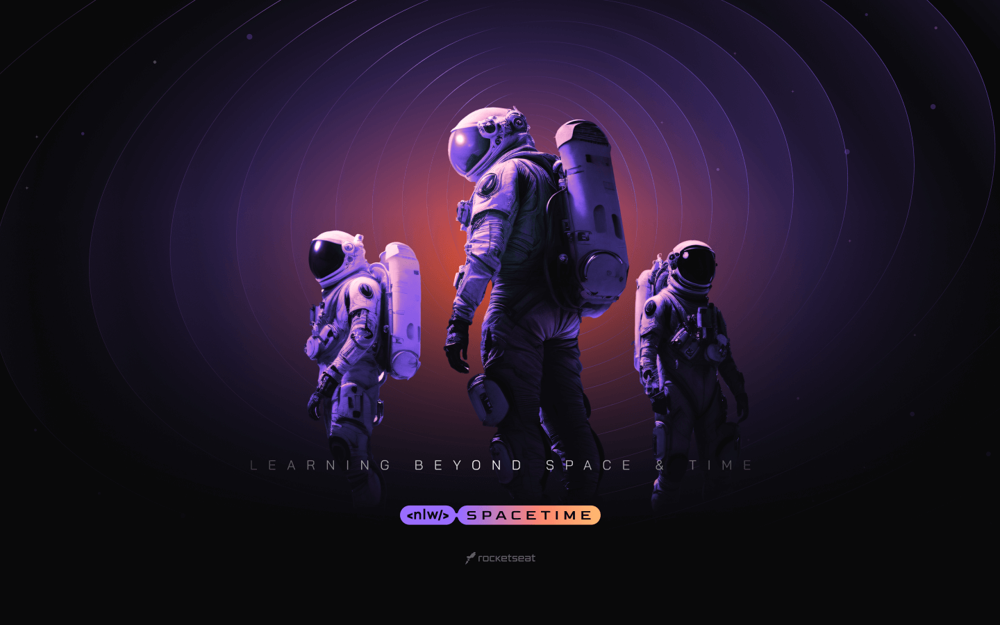

# nlw-spacetime

## Summary

1. [Description](#description)
2. [How to start](#how-to-start)
3. [Technologies](#technologies)

## Description

Project NLW Spacetime is a memory timeline.  
You can create a new memory and share if you want, and see others publics memories too.

  

## How to start

1. Clone this repo.
2. On your github, go on Settings >> Developer Settings >> OAuth Apps.
3. Click on _New OAuth App_ and create one for each frontwend: WEB and MOBILE.
   
4. This project use **[OAuth Authentication](https://docs.github.com/en/apps/oauth-apps/building-oauth-apps/authorizing-oauth-apps)**.
5. Add the **Client id** and **Client Secret** on your backend `.env`. **[Go to backend section.](https://github.com/N0N4T0/nlw-spacetime/tree/main/server)**
6. Remember one thing: if you want to switch between WEB to MOBILE you have to change your `.env` value on your backend.
     

## Technologies

- **[Backend](https://github.com/N0N4T0/nlw-spacetime/tree/main/server)**

- **[Frontend WEB](https://github.com/N0N4T0/nlw-spacetime/tree/main/web)**

- **[Frontend MOBILE](https://github.com/N0N4T0/nlw-spacetime/tree/main/mobile)**
